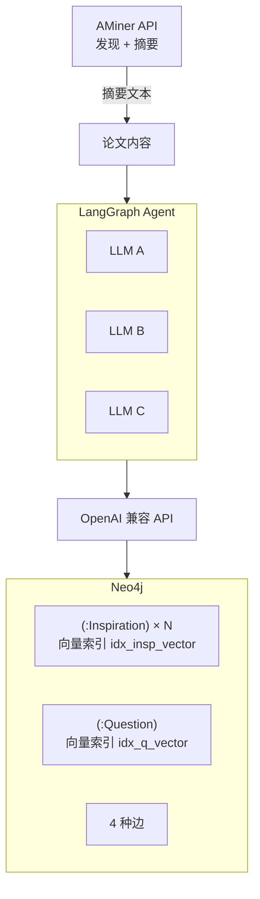
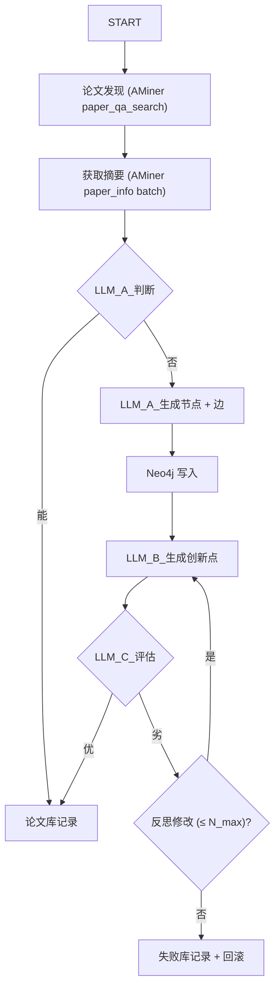
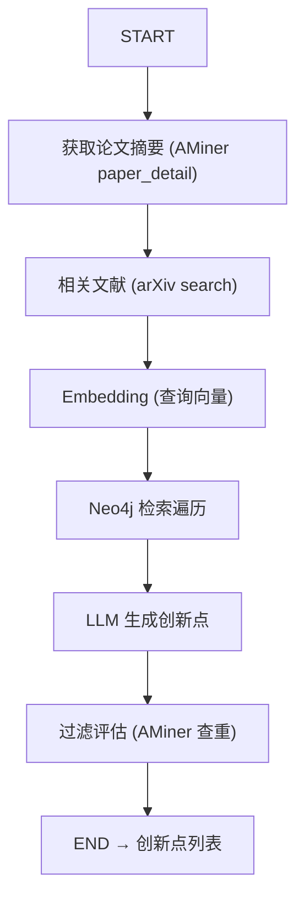

# 技术架构

## 1. 概述

V1 原型阶段。LLM / Embedding 均通过 OpenAI 兼容 API 统一接入。Neo4j Community Edition 同时承担图存储和向量检索。

## 2. 技术栈

| 层次 | 选型 | 版本约束 |
|---|---|---|---|
| Agent 框架 | LangGraph | >=0.3.0 |
| LLM SDK | langchain-openai | >=0.3.0 |
| 图数据库 | Neo4j Community | >=5.0 (HNSW) |
| 论文发现 + 摘要 | AMiner API（付费，低成本） | 需 `AMINER_API_KEY` |
| 论文全文（备选） | arXiv web_extract（免费） | 仅 arXiv 收录的论文 |
| 论文解析（备选） | pymupdf | >=1.24 |
| 数据验证 | pydantic | >=2.0 |
| 包管理 | uv | — |
| Python | — | >=3.11 |

## 3. 项目结构

```
~/Codes/IdeaForgeX/
├── AGENTS.md
├── pyproject.toml
├── doc/
│   ├── design.md
│   ├── architecture.md
│   └── data-model.md
├── src/
│   ├── main.py
│   ├── config.py
│   ├── agent/
│   │   ├── training.py
│   │   └── inference.py
│   ├── neo4j/
│   │   ├── client.py
│   │   ├── schema.py
│   │   └── retrieval.py
│   ├── llm/
│   │   ├── client.py
│   │   └── prompts.py
│   ├── paper/
│   │   ├── extractor.py
│   │   └── discovery.py
│   └── models.py
└── tests/
```

## 4. 模块职责

| 模块 | 职责 |
|---|---|
| `main.py` | CLI 入口：`bootstrap` / `train` / `infer` / `reset` / `stats` |
| `config.py` | 环境变量 → `Config` Pydantic 对象 |
| `models.py` | `InspirationNode`, `QuestionNode`, `Edge`, `InnovationIdea` 等 |
| `llm/client.py` | OpenAI 兼容客户端封装（chat + embedding） |
| `llm/prompts.py` | LLM A / B / C 的 system prompt 模板 |
| `neo4j/client.py` | `neo4j.Driver` 连接管理，基础 CRUD |
| `neo4j/schema.py` | 约束、向量索引创建（幂等），节点/边写入 |
| `neo4j/retrieval.py` | 向量搜索 + 5 阶段遍历 + 去重截断 |
| `paper/discovery.py` | AMiner 客户端：论文搜索 / 批量获取摘要 / 查重 |
| `paper/extractor.py` | arXiv web_extract 全文 + pymupdf 本地 PDF（备选） |
| `agent/training.py` | 训练 LangGraph StateGraph |
| `agent/inference.py` | 推理 LangGraph StateGraph |

## 5. 数据流



## 6. LangGraph 工作流

### 6.1 训练 StateGraph



LangGraph 特性：

- **Checkpointer**：每步后自动 checkpoint，支持中断恢复
- **条件边**：LLM_A/C 的判断结果路由到不同下游节点
- **RetryPolicy**：LLM 调用失败自动重试

### 6.2 推理 StateGraph



## 7. 检索遍历算法

### 伪代码

```python
# Phase 1: 向量检索
hits = vector_search(
    indexes=["idx_insp_vector", "idx_q_vector"],
    query_embedding=q_emb,
    k=config.k_hits  # 10
)
candidates = {n.id: (n, n.score) for n in hits}

# Phase 2: 精化链展开（不计 hop，无限深度）
for hit in hits where hit.label == "Inspiration":
    chain = neo4j.query("""
        MATCH (hit:Inspiration {id: $id})
        CALL {
            MATCH (hit)-[:INSP_REFINES*0..10]->(f:Inspiration) RETURN f
            UNION
            MATCH (c:Inspiration)-[:INSP_REFINES*0..10]->(hit) RETURN c AS f
        }
        RETURN DISTINCT f
    """)
    for node in chain:
        update_candidate(node, score=hit.score)

# Phase 3: 1-hop 扩展
new_nodes = []
for node_id, (node, score) in candidates.items():
    neighbors = neo4j.query("""
        MATCH (n {id: $id})-[r:INSP_COMBINES|INSP_QUESTION|QUESTION_COMBINES]-(m)
        RETURN m, r.weight AS w
        ORDER BY w DESC LIMIT $M
    """, M=config.max_neighbors)
    for m, w in neighbors:
        s = score * config.score_decay
        update_candidate(m, score=s)
        new_nodes.append((m, s))

# Phase 4: 2-hop 扩展
for node, src_score in new_nodes:
    neighbors = neo4j.query("""...LIMIT $M""", M=config.max_neighbors)
    for m, w in neighbors:
        s = src_score * config.score_decay  # 0.49 × 原始分
        update_candidate(m, score=s)

# Phase 5: 去重截断
final = sorted(candidates.values(), key=lambda t: t[1], reverse=True)[:config.final_k]
```

### 参数

| 参数 | 值 | 配置键 |
|---|---|---|
| k_hits | 10 | `config.k_hits` |
| max_neighbors | 3 | `config.max_neighbors` |
| max_depth | 2 | `config.max_depth` |
| score_decay | 0.7 | `config.score_decay` |
| final_k | 20 | `config.final_k` |

## 8. LLM 调用模式

所有 LLM 调用通过 `llm/client.py` 的 `ChatClient`：

```python
class ChatClient:
    def chat(self, messages: list[dict], response_format=None) -> dict:
        """调用 chat/completions，支持 JSON mode"""
    
    def embed(self, texts: list[str]) -> list[list[float]]:
        """调用 embeddings，返回向量列表"""
```

三个角色共用一个模型实例，通过 `prompts.py` 中的不同模板构建 messages。

## 9. 错误处理策略

| 场景 | 策略 |
|---|---|---|
| LLM JSON 解析失败 | RetryPolicy 自动重试，超过 `max_retries` 记录到失败库 |
| Neo4j 连接失败 | 抛异常退出，不静默 |
| 向量索引不存在 | `schema.py` 首次运行时幂等创建 |
| AMiner API 失败 | 重试 3 次，仍失败则跳过该论文 |
| arXiv 全文获取失败 | 降级为仅用摘要，标记缺少全文 |
| LLM A 判断「能推演」 | 仅记录论文库，不生成新节点 |

## 10. 依赖

```toml
[project]
name = "ideaforgex"
version = "0.1.0"
requires-python = ">=3.11"
dependencies = [
    "langgraph>=0.3.0",
    "langchain>=0.3.0",
    "langchain-openai>=0.3.0",
    "neo4j>=5.0.0",
    "pymupdf>=1.24.0",
    "openai>=1.0.0",
    "pydantic>=2.0.0",
    "pydantic-settings>=2.0.0",
    "httpx>=0.27.0",
]

[project.optional-dependencies]
dev = ["pytest>=8.0.0"]
```

## 11. 外部服务

| 服务 | 启动 | 健康检查 |
|---|---|---|
| Neo4j | `sudo systemctl start neo4j` | `neo4j status` |
| AMiner | 环境变量 `AMINER_API_KEY` | `curl -H "Authorization: $AMINER_API_KEY" https://datacenter.aminer.cn/gateway/open_platform/api/paper/search?query=test` |
| arXiv | 无需认证 | `curl "https://export.arxiv.org/api/query?id_list=2402.03300"` |
| LLM API | 环境变量配置 | `curl $OPENAI_BASE_URL/models` |
