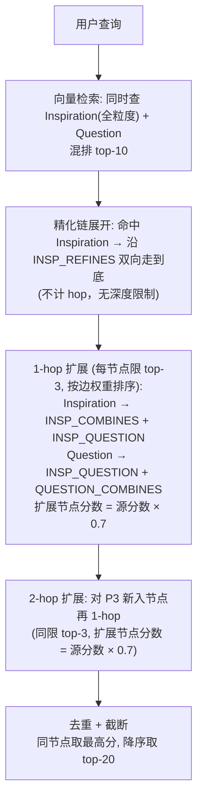
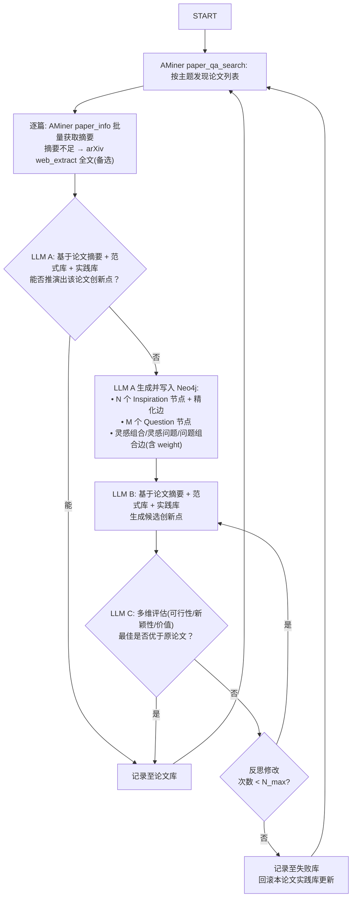
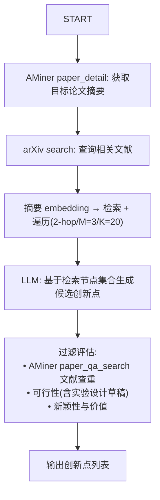

# 设计文档

## 1. 概述

IdeaForgeX 是一个 Agent 框架，在数据驱动下训练，使用时生成高价值 AI 论文创新点。

## 2. 核心设计决策

- **双节点类型**：实践库包含 `Inspiration`（方法/模式）和 `Question`（问题/缺口），平等参与语义检索。
- **多粒度精化链**：每个方法概念以 N 个 Inspiration 节点表示（N ≥ 1），`粒度` 整数字段（0 起，越小越抽象）区分层级，灵感精化边（有向，低→高）串联。
- **范式库固定**：8 个认知框架作为思考引擎，不随训练更新。
- **评审角色分离**：LLM A/B/C 用同一模型但不同 system prompt，分析/生成与评估分离以减少自我强化偏差。
- **边附权重**：每条无向边附带 `weight: float`（LLM A 给定 0~1 分），用于检索排序。
- **论文来源**：AMiner API 发现全网论文 + 获取摘要（付费，成本极低）；arXiv API 仅作全文备选（免费）。

## 3. 四大库

### 3.1 范式库

8 个认知框架：

1. 二分关联 (Bisociation) — 连接两个不相关的参照系
2. 问题重构 (Problem Reformulation) — 换一种方式表述问题
3. 类比推理 (Analogical Reasoning) — 深层因果结构迁移
4. 约束操控 (Constraint Manipulation) — 探索/组合/转换三类创造
5. 否定翻转 (Negation/Inversion) — 否定核心假设
6. 抽象阶梯 (Abstraction Ladder) — 泛化/特化/类比三个方向
7. 相邻可能 (Adjacent Possible) — 在可触及边界上创新
8. 双面思维 (Janusian) — 同时持有矛盾，超越对立

固定不变，仅为 LLM A/B 提供思考框架。

### 3.2 实践库

存储 Inspiration 和 Question 两种节点及四种边。Neo4j 异构图 + HNSW 向量索引。

#### 节点字段

**Inspiration**：

| 字段 | 类型 | 说明 |
|---|---|---|
| id | string | `insp-{uuid}` |
| 粒度 | int | 0=纯认知操作, 1=方法族, 2=技术方案, 3+=具体变体 |
| 核心描述 | string | 该粒度描述文本（embedding 源） |
| 向量 | list[float] | embedding API 产出，向量索引 |
| 前提条件 | string | 适用场景 |
| 操作步骤 | string | 转化为创新的步骤 |
| 已知实例 | string | 体现该模式的论文（可缺省） |

**Question**：

| 字段 | 类型 | 说明 |
|---|---|---|
| id | string | `q-{uuid}` |
| 核心描述 | string | 一句话描述（embedding 源） |
| 向量 | list[float] | embedding API 产出，向量索引 |
| 问题类型 | string | 理论缺口 / 工程瓶颈 / 评估缺失 / 跨领域空白 |
| 当前现状 | string | 已有方法解决的部分 |
| 未解决部分 | string | 具体未解决的问题 |

#### 粒度语义

| 粒度 | 检索目标 | 写法 |
|---|---|---|
| 0 | 跨领域召回 | 纯认知操作，去除领域专有名词 |
| 1 | 跨任务召回 | 保留方法类型标签，去除具体模型 |
| 2 | 精确匹配 | 含具体实现手法 |
| 3+ | 极高精度 | 含具体模型/数据集/超参变体，按需扩展 |

绝大多数 inspiration 用 0/1/2 三级。仅当概念有足够丰富的变体细节时才扩展到 3+。

#### 四种边

| 名称 | Neo4j 标签 | 端点 | 方向 | 权重 | 语义 |
|---|---|---|---|---|---|
| 灵感组合边 | `INSP_COMBINES` | Inspiration ↔ Inspiration | 无向 | 0~1 | 组合产生新方向 |
| 灵感问题边 | `INSP_QUESTION` | Inspiration ↔ Question | 无向 | 0~1 | 方法 ↔ 问题 |
| 问题组合边 | `QUESTION_COMBINES` | Question ↔ Question | 无向 | 0~1 | 交集定义新缺口 |
| 灵感精化边 | `INSP_REFINES` | Inspiration → Inspiration | 有向 | 1.0 | 低粒度→高粒度 |

约束：灵感精化边链上任意两节点间距 ≤ 2-hop → 同属一个方法概念。LLM A 生成时确保同概念节点按粒度递增串联为单链。

#### 问题组合边定义

两个 question 各自独立，但**交集定义了一个新的研究缺口**——该缺口：(a) 比任一单独问题更有趣，(b) 无法仅由其中一个驱动产生，(c) 不是简单的「同时解决两问题」。

正例：

- 「长文本中间丢失」×「缺乏显式记忆管理」→ 选择性上下文记忆机制
- 「扩散模型推理慢」×「生成缺乏全局结构约束」→ 结构先验引导加速去噪
- 「视觉-语言全局对齐」×「开放词汇检测依赖标注框」→ 弱对齐下的细粒度区域定位

反例：

- 仅领域归类：低资源 NER × 跨语言对齐差 → 同领域无新缺口
- 纯工程叠加：显存不足 × 标注噪声 → 多约束下的常规优化

### 3.3 论文库

已训练论文 ID 集合，仅用于去重。不存向量。

### 3.4 失败库

LLM 无法模仿其创新点的论文 + LLM C 评估摘要。人工定期审查。

## 4. 检索遍历

```
向量搜索(top-10) → 精化链展开(双向不限深) → 1-hop(top-3, 按weight) → 2-hop(top-3, 按weight) → 去重截断(top-20)
```



参数：

| 参数 | 值 | 说明 |
|---|---|---|
| k_hits | 10 | 向量搜索命中数 |
| M | 3 | 每节点边扩展上限 |
| max_depth | 2 | 非精化边最大遍历深度 |
| score_decay | 0.7 | 每跳分数衰减因子 |
| K | 20 | 最终输出节点数 |

## 5. 训练流程



核心验证信号：LLM C 多维评估，不依赖外部实验。

## 6. 推理流程



## 7. LLM 角色

| 角色 | 职责 | 输入 | 输出 |
|---|---|---|---|
| LLM A | 判断 + 生成节点及边 | AMiner 摘要 + 范式库 + 实践库 | 判断 + 节点 JSON + 边 JSON(含 weight) |
| LLM B | 生成创新点候选 | 论文摘要 + 检索节点(top-20) | 创新点列表 |
| LLM C | 多维评估 | 原论文 + 创新点候选 | 评分 + 反思建议 |

V1 三角色用同一模型，不同 system prompt 区分。

## 8. 冷启动

训练前 LLM 手动生成种子 Inspiration 和 Question 节点填充实践库。非精化边也需在冷启动时手动建立。
