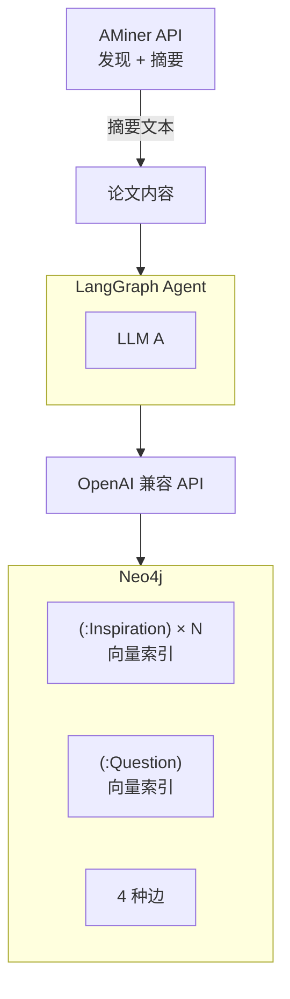

# 技术架构

## 1. 概述

V1 原型阶段。LLM / Embedding 均通过 OpenAI 兼容 API 统一接入。Neo4j Community Edition 同时承担图存储和向量检索。

## 2. 技术栈

| 层次 | 选型 |
|---|---|
| Agent 框架 | LangGraph |
| LLM SDK | openai |
| 图数据库 | Neo4j Community |
| 论文来源 | AMiner API (付费) + arXiv (免费备选) |
| 向量检索 | Neo4j HNSW 向量索引 |
| 数据验证 | pydantic |
| 包管理 | uv |
| Python | >=3.11 |

## 3. 项目结构

```
~/Codes/IdeaForgeX/
├── docs/                # 设计与架构文档
├── src/
│   ├── main.py          # 入口
│   ├── config.py        # 配置管理
│   ├── models.py        # 数据模型
│   ├── agent/           # LangGraph 工作流
│   ├── neo4j/           # 图数据库操作
│   ├── llm/             # LLM 调用与 prompt
│   └── paper/           # 论文获取与解析
└── tests/
```

## 4. 数据流



## 5. 工作流概览

### 5.1 训练

```
加载论文 → LLM提炼查询 → 图检索 → LLM判断(修改已有/新增节点) → 事务写入
```

6 节点 StateGraph，2 次 LLM 调用，条件边路由。写入顺序：先 `MATCH+SET` 更新已有节点，再 `CREATE` 新节点。

### 5.2 推理

```
加载论文 → 图检索 → LLM生成创新点候选
```

3 节点 StateGraph，1 次 LLM 调用，不写入 Neo4j。

## 6. 检索遍历

5 阶段策略：向量搜索(Inspiration+Question) → 精化链双向展开 → 1-hop 扩展 → 2-hop 扩展 → 去重截断。

扩展开销由 `k_hits`、`max_neighbors`、`max_depth`、`score_decay` 控制，全部可配置。

## 7. LLM 调用

所有 LLM 调用统一通过重试机制，JSON 解析失败自动重试。训练 3 种 prompt 模板（查询生成、判断、推理生成），对应不同 parser。

## 8. 错误处理

- LLM JSON 解析失败：自动重试
- Neo4j 连接失败：抛异常退出，不静默
- AMiner API 失败：重试后跳过该论文
- arXiv 全文获取失败：降级为仅用摘要
- 向量索引不存在：启动时幂等创建
