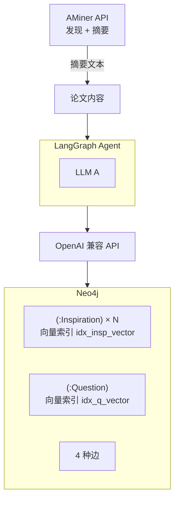
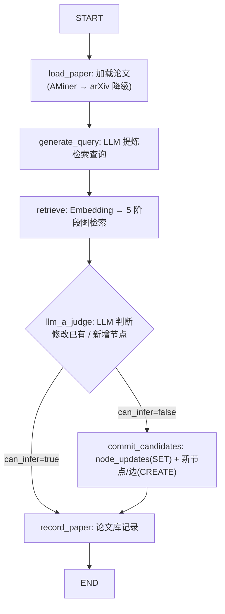
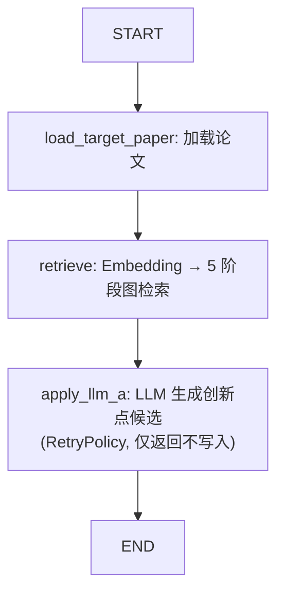

# 技术架构

## 1. 概述

V1 原型阶段。LLM / Embedding 均通过 OpenAI 兼容 API 统一接入。Neo4j Community Edition 同时承担图存储和向量检索。

## 2. 技术栈

| 层次 | 选型 | 版本约束 |
|---|---|---|---|
| Agent 框架 | LangGraph | >=0.3.0 |
| LLM SDK | langchain-openai | >=0.3.0 |
| 图数据库 | Neo4j Community | 最新稳定版 |
| 论文发现 + 摘要 | AMiner API（付费，低成本） | 需 `AMINER_API_KEY` |
| 论文全文（备选） | arXiv web_extract（免费） | 仅 arXiv 收录的论文 |
| 论文解析（备选） | pymupdf | >=1.24 |
| 数据验证 | pydantic | >=2.0 |
| 包管理 | uv | — |
| Python | — | >=3.11 |

## 3. 项目结构

```
~/Codes/IdeaForgeX/
├── AGENTS.md
├── pyproject.toml
├── docs/
│   ├── design.md
│   ├── architecture.md
│   └── data-model.md
├── src/
│   ├── main.py
│   ├── config.py
│   ├── models.py
│   ├── agent/
│   │   ├── common.py
│   │   ├── training.py
│   │   └── inference.py
│   ├── neo4j/
│   │   ├── client.py
│   │   ├── maintenance.py
│   │   ├── schema.py
│   │   └── retrieval.py
│   ├── llm/
│   │   ├── client.py
│   │   ├── prompts.py
│   │   └── service.py
│   ├── paper/
│   │   ├── extractor.py
│   │   ├── resolver.py
│   │   └── discovery.py
│   └── models.py
└── tests/
```

## 4. 模块职责

| 模块 | 职责 |
|---|---|
| `config.py` | 环境变量 + YAML → `Config` Pydantic 对象 |
| `models.py` | `InspirationNode`, `QuestionNode`, `Edge`, `NodeUpdate`, `LLMACandidate`, `InnovationIdea` |
| `llm/client.py` | OpenAI 兼容客户端封装（chat + embedding，LLM/Embedding 双 client） |
| `llm/prompts.py` | 3 种 prompt 模板：查询生成、训练判断、推理生成 |
| `llm/service.py` | `call_with_retry`：JSON mode LLM 调用 + 自动重试 |
| `neo4j/client.py` | `neo4j.Driver` 连接管理 |
| `neo4j/maintenance.py` | `clear_graph` 全量清图 + `resolve_target_uri` 端口映射 |
| `neo4j/schema.py` | 约束/向量索引创建（幂等），节点/边写入，节点更新（`update_node`） |
| `neo4j/retrieval.py` | 向量搜索 + 5 阶段遍历 + 去重截断 |
| `paper/discovery.py` | AMiner 客户端：论文搜索 / 批量获取摘要 / 查重 |
| `paper/extractor.py` | arXiv API + pymupdf PDF 解析 |
| `paper/resolver.py` | `load_paper_record`（AMiner→arXiv 降级）+ `build_practice_summary` |
| `agent/common.py` | `parse_llm_a_candidate`、`parse_query_text` 解析器 |
| `agent/training.py` | 训练 LangGraph：6 节点（load → query → retrieve → judge → route → commit） |
| `agent/inference.py` | 推理 LangGraph：3 节点（load → retrieve → generate） |

## 5. 数据流



## 6. LangGraph 工作流

### 6.1 训练 StateGraph



LangGraph 特性：

- **6 节点**：load_paper / generate_query / retrieve / llm_a_judge / record_paper / commit_candidates
- **2 次 LLM 调用**：查询生成 + 判断/生成（均有 RetryPolicy）
- **条件边**：`can_infer` 路由到 `record_paper` 或 `commit_candidates`
- **事务写入**：先 `batch_update`（MATCH+SET）后 `batch_write`（CREATE）

### 6.2 推理 StateGraph



3 节点，1 次 LLM 调用。

## 7. 检索遍历算法

### 伪代码

```python
# Phase 1: 向量检索
hits = vector_search(
    indexes=["idx_insp_vector", "idx_q_vector"],
    query_embedding=q_emb,
    k=config.k_hits  # 10
)
candidates = {n.id: (n, n.score) for n in hits}

# Phase 2: 精化链展开（不计 hop，无限深度）
for hit in hits where hit.label == "Inspiration":
    chain = neo4j.query("""
        MATCH (hit:Inspiration {id: $id})
        CALL {
            MATCH (hit)-[:INSP_REFINES*0..10]->(f:Inspiration) RETURN f
            UNION
            MATCH (c:Inspiration)-[:INSP_REFINES*0..10]->(hit) RETURN c AS f
        }
        RETURN DISTINCT f
    """)
    for node in chain:
        update_candidate(node, score=hit.score)

# Phase 3: 1-hop 扩展
new_nodes = []
for node_id, (node, score) in candidates.items():
    neighbors = neo4j.query("""
        MATCH (n {id: $id})-[r:INSP_COMBINES|INSP_QUESTION|QUESTION_COMBINES]-(m)
        RETURN m, r.weight AS w
        ORDER BY w DESC LIMIT $M
    """, M=config.max_neighbors)
    for m, w in neighbors:
        s = score * config.score_decay
        update_candidate(m, score=s)
        new_nodes.append((m, s))

# Phase 4: 2-hop 扩展
for node, src_score in new_nodes:
    neighbors = neo4j.query("""...LIMIT $M""", M=config.max_neighbors)
    for m, w in neighbors:
        s = src_score * config.score_decay  # 0.49 × 原始分
        update_candidate(m, score=s)

# Phase 5: 去重截断
final = sorted(candidates.values(), key=lambda t: t[1], reverse=True)[:config.final_k]
```

### 参数

| 参数 | 值 | 配置键 |
|---|---|---|
| k_hits | 10 | `config.k_hits` |
| max_neighbors | 3 | `config.max_neighbors` |
| max_depth | 2 | `config.max_depth` |
| score_decay | 0.7 | `config.score_decay` |
| final_k | 20 | `config.final_k` |

检索实现规则：`Inspiration` 与 `Question` 同时作为向量检索入口，命中后统一进入 hop 扩展；若命中 `Inspiration`，再额外展开 `INSP_REFINES` 双向链。

## 8. LLM 调用模式

所有 LLM 调用通过 `llm/service.py` 的 `call_with_retry`：

```python
def call_with_retry(client, messages, max_retries=3, temperature=0.1, parser=None):
    for attempt in range(max_retries):
        payload = client.chat_json(messages, temperature=temperature)
        return parser(payload) if parser else payload
```

三种 prompt 模板：

| 模板 | 文件 | 用途 | 调用时 parser |
|---|---|---|---|
| `build_query_generation_messages` | `prompts.py` | 训练：从论文提炼检索查询 | `parse_query_text` |
| `build_llm_a_judge_messages` | `prompts.py` | 训练：判断 + 生成节点/边/更新 | `parse_llm_a_candidate` |
| `build_inference_messages` | `prompts.py` | 推理：生成创新点候选 | `parse_llm_a_candidate` |

输出结构 `LLMACandidate`：

```python
class LLMACandidate(BaseModel):
    can_infer: bool = False
    query_text: str = ""
    inspiration_nodes: list[InspirationNode]
    question_nodes: list[QuestionNode]
    edges: list[Edge]
    node_updates: list[NodeUpdate]  # 训练时已有节点的增量更新
```

## 9. 错误处理策略

| 场景 | 策略 |
|---|---|
| LLM JSON 解析失败 | RetryPolicy 自动重试，超过 `max_retries` 直接失败 |
| Neo4j 连接失败 | 抛异常退出，不静默 |
| 向量索引不存在 | `schema.py` 首次运行时幂等创建 |
| AMiner API 失败 | 重试 3 次，仍失败则跳过该论文 |
| arXiv 全文获取失败 | 降级为仅用摘要，标记缺少全文 |
| LLM A 判断「能推演」 | 仅记录论文库，不生成新节点 |

## 10. 依赖

```toml
[project]
name = "ideaforgex"
version = "0.1.0"
requires-python = ">=3.11"
dependencies = [
    "langgraph>=0.3.0",
    "langchain>=0.3.0",
    "langchain-openai>=0.3.0",
    "neo4j>=5.0.0",
    "pymupdf>=1.24.0",
    "openai>=1.0.0",
    "pydantic>=2.0.0",
    "pydantic-settings>=2.0.0",
    "httpx>=0.27.0",
]

[project.optional-dependencies]
dev = ["pytest>=8.0.0"]
```

## 11. 外部服务

| 服务 | 启动 | 健康检查 |
|---|---|---|
| Neo4j | `sudo systemctl start neo4j` | `neo4j status` |
| AMiner | 环境变量 `AMINER_API_KEY` | `curl -H "Authorization: $AMINER_API_KEY" https://datacenter.aminer.cn/gateway/open_platform/api/paper/search?query=test` |
| arXiv | 无需认证 | `curl "https://export.arxiv.org/api/query?id_list=2402.03300"` |
| LLM API | 环境变量配置 | `curl $OPENAI_BASE_URL/models` |
