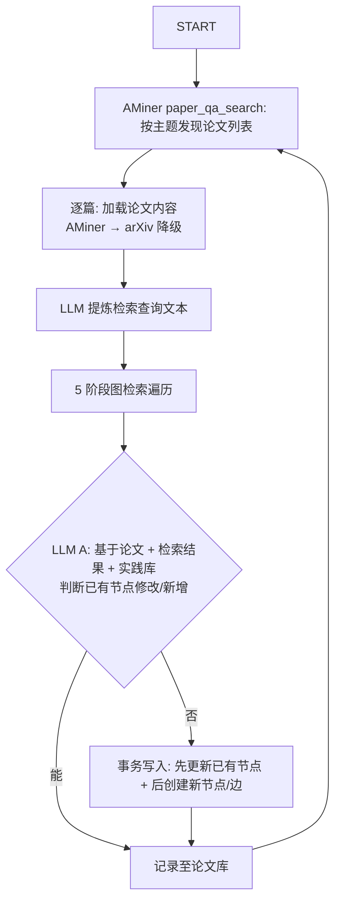
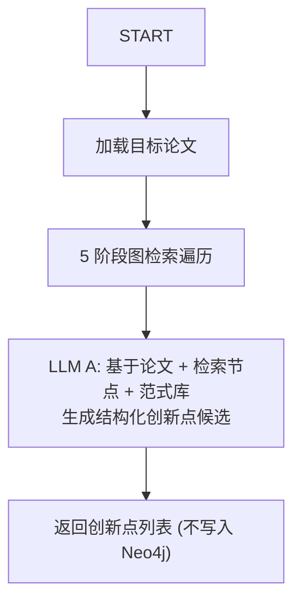

# 设计文档

## 1. 概述

IdeaForgeX 是一个 Agent 框架，在数据驱动下训练，使用时生成高价值 AI 论文创新点。

## 2. 核心设计决策

- **双节点类型**：实践库包含 `Inspiration`（方法/模式）和 `Question`（问题/缺口），平等参与语义检索。
- **多粒度精化链**：每个方法概念以 N 个 Inspiration 节点表示（N ≥ 1），`粒度` 整数字段（1 起，1=抽象范式/2=通用方法/3=技术实现，越小越抽象）区分层级，精化边（有向，低→高，严格 N→N+1 递进）串联。
- **范式库固定**：8 个认知框架作为思考引擎，不随训练更新。
- **边附权重**：每条边附带 `weight: float`，LLM 给定 0~1 分，用于检索排序。
- **论文来源**：AMiner API 发现全网论文 + 获取摘要（付费，成本极低）；arXiv API 仅作全文备选（免费）。
- **配置驱动**：Embedding 维度、检索 top-k、hop 上限、分数衰减等变量全部可配置，不在代码中硬编码。

## 3. 四大库

### 3.1 范式库

8 个认知框架，固定不变，仅为 LLM 提供思考结构：

1. 二分关联 — 连接两个不相关的参照系
2. 问题重构 — 换一种方式表述问题
3. 类比推理 — 深层因果结构迁移
4. 约束操控 — 探索/组合/转换三类创造
5. 否定翻转 — 否定核心假设
6. 抽象阶梯 — 泛化/特化/类比三个方向
7. 相邻可能 — 在可触及边界上创新
8. 双面思维 — 同时持有矛盾，超越对立

### 3.2 实践库

Neo4j 异构图，存储 Inspiration 和 Question 两种节点及四种边。向量检索通过 HNSW 索引。

**Inspiration**：代表被抽象化的方法模式/技术思想。核心属性包括粒度（抽象层级）、核心描述（embedding 源）、前提条件、操作步骤、已知实例。

**Question**：代表未被完全解决的研究缺口。核心属性包括问题类型（理论缺口/工程瓶颈/评估缺失/跨领域空白）、当前现状、未解决部分。

训练时 LLM 可对已有节点进行增量属性修改（如补充新的已知实例、更新当前现状），但不能修改节点的 ID、核心描述和向量。

**粒度**：整数 1-3。1=抽象范式、2=通用方法、3=技术实现。精化边必须从粒度 N 指向 N+1，不可跳跃。

**四种边**：

| 边 | 含义 | 方向 |
|---|---|---|
| 灵感精化边 | 低粒度→高粒度（N→N+1，严格递进），同方法概念的纵向展开 | 有向 |
| 灵感组合边 | 两种不同方法组合产生新方向 | 无向 |
| 灵感问题边 | 某方法可驱动某问题的解决 | 无向 |
| 问题组合边 | 两问题交集定义新的、更有趣的研究缺口 | 无向 |

### 3.3 论文库

已训练论文 ID 集合，仅去重，不存向量。

### 3.4 失败库

当前 A-only 版本不写失败库。

## 4. 检索遍历

5 阶段：向量搜索（Inspiration + Question 混合 top-k）→ 精化链双向展开（不限深）→ 1-hop 扩展（按权重截断）→ 2-hop 扩展 → 去重按分数截断。

每一步的 k、hop 数、衰减因子均可配置。

## 5. 训练流程

## 6. 推理流程

## 7. LLM 角色

| 角色 | 职责 | 使用阶段 |
|---|---|---|
| LLM A (查询提炼) | 从论文提取 1-2 句检索查询 | 训练 |
| LLM A (判断/生成) | 判断已有节点修改/新增，生成节点和边 | 训练 |
| LLM A (创新生成) | 基于论文+检索结果+范式库生成创新点候选 | 推理 |

V1 仅保留 LLM A。训练用 2 次 LLM 调用，推理用 1 次。

## 8. 冷启动

训练前手动生成种子 Inspiration 和 Question 节点填充实践库。非精化边也需在冷启动时手动建立。
